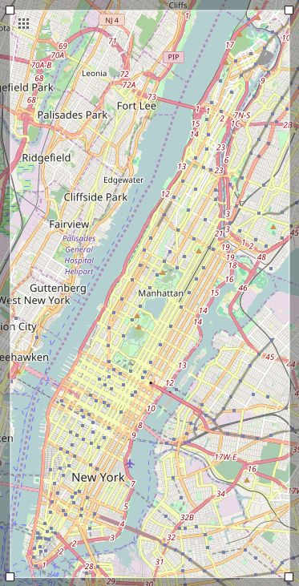

# OpenStreetMap-Manhattan

For this project, I've chosen to take a look at the island I've been living on for the past eight years: New York County, NY, otherwise known as Manhattan.



I extracted this data by using [OpenStreetMap's Export Tool](https://www.openstreetmap.org/export#map=12/40.7674/-73.9394) to manually create a box to be downloaded with Overpass

```
    (node(40.6983, -74.0242, 40.8816, -73.9054);<;);
    out meta;
```

then I saved the file as `manhattan_new-york.osm`. The limitations of a bounding box prevent me from selecting *only* Manhattan, so bits of the Bronx, Brooklyn, Queens, and New Jersey are going to be included. I will take note of this when I make some of my SQL queries.

The full report can be found [here](https://github.com/djevans071/OpenStreetMap-Manhattan/blob/master/report.md).
