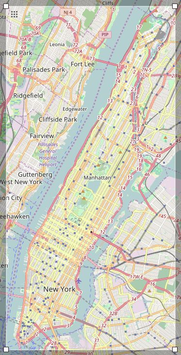
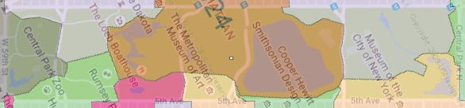

# OpenStreetMap Case Study for Manhattan, NY, USA

For this project, I've chosen to take a look at the island I've been living on for the past eight years: New York County, NY, otherwise known as Manhattan.



Manhattan is at once recognizable and constantly changing. It is the most densely populated island in the United States and is a world unto itself.

I extracted map data by using [OpenStreetMap's Export Tool](https://www.openstreetmap.org/export#map=12/40.7674/-73.9394) to manually create a box to be downloaded with Overpass

```
    (node(40.6983, -74.0242, 40.8816, -73.9054);<;);
    out meta;
```

then I saved the file as `manhattan_new-york.osm`. The limitations of a bounding box prevent me from selecting Manhattan by itself, so bits of the Bronx, Brooklyn, Queens, and New Jersey are going to be included. I will take note of this when I make some of my SQL queries.


## Initial Issues with Map Data

While I was auditing the data with `audit.py`, I noticed the following anomalies:

 * Misspelling of common street names, like `steet` for `Street` or `Avene` for `Avenue`.
 * Some street names contain whole addresses.
 * The use of alternative street names, most notably `Avenue of the Americas` for `6th Avenue`, or street names like `Lafayette` instead of `Lafayette Street`.
 * Nine digit zip codes like `10001-2062` and zip codes containing letters like `NY 10111`.
 * Invalid zip codes like `100014`, `320`, or `83`

### Inconsistent Street Names
Most inconsistencies in street names are rectified by updating the `mapping` dictionary in `audit.py` and applying a simple renaming module (`update_name` in `audit.py`):

```python
def update_name(name, mapping):
    # update street name if the last word is in the mapping dictionary
    word_list = name.split()
    if word_list[-1] in mapping:
        word_list[-1] = mapping[word_list[-1]]
    name = ' '.join(word_list)
    return name
```
However, some street names are actually inputted as whole addresses like the following:

 ```python
'10024': set(['West 80th Street NYC 10024']),
'NY': set(['405 West 23rd Street, New York, NY',
           '54th W 39th St New York, NY',
           'West 49th Street New York NY']),
'USA': set(['424 5th Avenue, 10018 NY, USA']),
'Unidos': set(['519 9th Ave, New York, NY 10018, Estados Unidos']),
'Uniti': set(['3rd Ave, New York, NY 10028, Stati Uniti'])
 ```

 There are three different ways these addresses are formatted. The address elements are comma separated, spaced separated with `New York` after the address, or space separated with `NYC` after the address. To extract the address only, we modify the `update_name` module as follows:

 ```python
    elif word_list[-1] == '10024':
        ind = name.find('NYC')
        return name[:ind-1]

    # slice address before 'New York' and recursively update the street name
    elif word_list[-1] == 'NY':
        ind = name.find('New York')
        return update_name(name[:ind-1], mapping)

    # take the address before first comma and recursively update street name
    elif word_list[-1] in ['USA', 'Unidos', 'Uniti']:
        street = name.split(',')[0]
        return update_name(street, mapping)
```

### Inconsistent Zip Codes

Things get more interesting with zip codes. Modifying inconsistent zip codes is quite straightforward, as it involves stripping away extraneous characters. A simple `try/except` snippet in the `update_zip` module does the trick.

```python
def update_zip(zip_name):
    # returns consistent zip code values
    try:    # try converting zip code to int
        int(zip_name)
    except ValueError: # process zip code if it contains non-int values
        if '-' in zip_name:
            betterzip = zip_name.split('-')[0]
        elif 'NY' in zip_name:
            betterzip = zip_name.split()[-1]
        return betterzip
    else: # special case
        if zip_name == '100014':
            zip_name = '10014'
        return zip_name
```

 More interesting problems crop up when dealing with invalid zip codes. Besides the obviously mistyped `100014`, I found three: `320`, `83`, `97657`. Let us examine them more closely.

First I identify the ids where these zip codes appear.  After running a  provisional version of `data.py` to write the CSV files I imported into the database file `opensm-manhattan.db`, I used the following SQL query using `query.py` (Using this [resource](http://www.datacarpentry.org/python-ecology-lesson/08-working-with-sql), I can output SQL queries as Pandas dataframes):

```sql
SELECT *
FROM (SELECT * FROM nodes_tags UNION ALL
      SELECT * FROM ways_tags) tags
WHERE tags.key = 'postcode'
AND (length(tags.value) < 5) OR tags.value = '97657';
```

There are 5 unique ids where these problematic zip codes appear.
```
        id       key  value  type
1950758029  postcode    320  addr
 184578578  postcode    320  addr
 188201723  postcode  97657  addr
 265347580  postcode     83  addr
 278366155  postcode     83  addr
```

Using the `get_specific_element` module in `sample.py`, I can pull up the XML entries for those ids.

#### Zip Codes "320" and "97657"

Both entries with zip code `320` have the same basic tags. I've only included the relevant subtags.

```xml
<node changeset="13398343" id="1950758029" lat="40.8524674" lon="-73.9733050"
 timestamp="2012-10-07T13:55:53Z" uid="714008" user="ubuka0" version="1">
    <tag k="addr:postcode" v="320" />
    <tag k="addr:street" v="Main Street" />
    <tag k="name" v="Fort Lee Public Library" />
</node>
```

The `name` subtag gives it away. The Fort Lee Public Library's address 320 Main Street, Fort Lee, NJ 07024. It looks like the user inputted `320` as the zip code instead of the building number by mistake. The correct zip code for this entry should be `07024`. A special line in `update_zip` makes the appropriate update.

Similarly, the zip code `97657` was mistyped. It is supposed to be `07657`.

#### Zip Code "83"

In this case, there are two different XML entries, each of which are `way` tags. Node subtags are suppressed.

```xml
<way changeset="21017219" id="265347580" timestamp="2014-03-10T00:29:09Z"
 uid="1764427" user="lxbarth_nycbuildings" version="1">
    <tag k="addr:housenumber" v="830" />
    <tag k="addr:postcode" v="83" />
    <tag k="addr:street" v="5th Avenue" />
    <tag k="building" v="office" />
</way>

<way changeset="41243585" id="278366155" timestamp="2016-08-04T17:57:24Z"
 uid="40023" user="ALE!" version="5">
    <tag k="addr:housenumber" v="34" />
    <tag k="addr:postcode" v="83" />
    <tag k="addr:street" v="Central Park North" />
    <tag k="name" v="Dana Discovery Center" />
</way>
```

Curiously, both these addresses are located in Central Park. The first is 830 5th Avenue, which on further inspection is [The Arsenal][1], whose zip code is 10065. The second is the Charles A. Dana Discovery Center which is located on the North side of Central Park at 10029. Zip codes are difficult to determine for Central Park because it is split up into [10 different zip code zones](http://www.zipmap.net/New_York/New_York_County.htm).

[1]: https://en.wikipedia.org/wiki/Arsenal_(Central_Park)



Updating these zip codes involves modifying the `shape_element` module within `data.py`:
```python
# special case: update postal code '83' to correct postal codes
id_zips = {'265347580':'10065', '278366155':'10029'}
for id_, zip_ in id_zips.items():
    if way_attribs['id'] == id_:
        for tag in tags:
            if tag['key'] == 'postcode':
                tag['value'] = zip_
```

There are many other places where the data have potential problems, including inconsistent city names, redundant keys for secondary tags, incomplete addresses (including the lack of zip codes for certain addresses), but as far as the street addresses and zip codes available are concerned, our dataset is now cleaned.

## Database Overview

Here are some basic SQL queries and their results regarding the dataset.

### Database size

#### File sizes

```
manhattan_new-york.osm    297 MB
opensm-manhattan.db       172 MB
nodes.csv                 100 MB
nodes_tags.csv           7.99 MB
ways.csv                 11.8 MB
ways_nodes.csv           36.9 MB
ways_tags.csv            31.9 MB
```

#### Number of nodes and ways

```sql
SELECT count(*) AS numNodes FROM nodes;
```
`numNodes = 1157859`

```sql
SELECT count(*) AS numWays FROM ways;
```
`numWays = 186029`

#### Number of node and way tags

```sql
SELECT count(*) AS numNodes_tags FROM nodes_tags;
```
`numNodes_tags = 232691`

```sql
SELECT count(*) AS numWays_tags FROM ways_tags;
```
`numWays_tags = 1017504`


### User statistics

#### Number of unique users

```sql
SELECT count(distinct(a.uid)) AS numUsers
FROM (SELECT uid FROM nodes UNION ALL
      SELECT uid FROM ways) a;
```
`numUsers = 1785`

#### Top 10 users by contribution

```sql
SELECT a.user, count(*) AS num
FROM (SELECT user FROM nodes UNION ALL
      SELECT user FROM ways) a
GROUP BY 1
ORDER BY 2 DESC
LIMIT 10;
```
```
                    user     num
0     Rub21_nycbuildings  882162
1   lxbarth_nycbuildings   76303
2                 robgeb   65948
3               minewman   44980
4                 Korzun   27747
5               mikercpc   20699
6        woodpeck_fixbot   11348
7   ingalls_nycbuildings    7823
8                   ALE!    7507
9  LizBarry_nycbuildings    7116
```
#### Number of single-contribution users

```sql
SELECT count(*) AS numOnetimeUsers
FROM (
    SELECT a.user, count(*) AS num
    FROM (SELECT user FROM nodes UNION ALL
          SELECT user FROM ways) a
    GROUP BY 1
    HAVING num=1) u;
```
`numOnetimeUsers = 585`

It is noteworthy to point out that four of the top ten users have `_nycbuildings` in their username, and that the top user has more than ten times the number of submissions compared to the next highest contributor.

Here are some other user statistics:
 * Top user `Rub21_nycbuildings` contributed 65.6% of total submissions
 * The top 10 users contributed 85.7% of total submissions
 * The average number of submissions is 753 and the median is 3
 * If we remove the top 10 contributors, the average contribution drops to 108
 * The interquartile percentiles are:
  * 25%: 1 submission
  * 50%: 3 submissions
  * 75%: 16 submissions
 * Single-contribution users as a percentage of total users: 32.8%


## Database Exploration

Let us take a closer look at the node and way tag data.
Some of these queries are adapted from [carlward's sample SQL OpenStreetMap project exploring Charlotte, NC](https://gist.github.com/carlward/54ec1c91b62a5f911c42#file-sample_project-md).

#### Number of zip code tags

```sql
SELECT COUNT(a.value) AS total_postalTags
FROM (SELECT * FROM nodes_tags UNION ALL
      SELECT * FROM ways_tags) a
WHERE a.key = 'postcode';
```
`total_postalTags = 150770`

#### Number of zip code tags by borough (including New Jersey)

Here's breakdown of zip codes by borough that we will need to incorporate to make the appropriate groupings:
 * Manhattan: 100XX, 101XX, or 102XX
 * Brooklyn: 112XX
 * Bronx: 104XX and Riker's Island (11370). Bronx also includes parts of 10705, but that is not in our map area
 * Queens:
  * 113XX (not including 11370), 114XX, and 116XX
  * 11004 and 11005
  * parts of 11040 and 11001, but those are not included in our map area
 * New Jersey: begins with 07XXX

```sql
SELECT CASE
            WHEN (a.value BETWEEN 10000 AND 10299)
            THEN 'manhattan'
        WHEN (a.value LIKE '112%')
            THEN 'brooklyn'
        WHEN (a.value LIKE '104%' OR a.value = '11370')
            THEN 'bronx'
        WHEN (a.value LIKE '07%')
            THEN 'nj'
        WHEN (a.value LIKE '111%'
            OR   (a.value LIKE '113%' AND a.value != '11370')
            OR   a.value LIKE '114%'
            OR   a.value LIKE '116%'
            OR   a.value between '11004' AND '11005')
            THEN 'queens'
        END as borough,
      COUNT(a.value) AS numTags
FROM (SELECT * FROM nodes_tags UNION ALL
      SELECT * FROM ways_tags) a
WHERE a.key = 'postcode'
GROUP BY borough
ORDER BY numTags DESC;
```
```
  borough  numTags
manhattan    59284
   queens    45946
 brooklyn    24160
    bronx    21307
       nj       73
```
Although Manhattan has the most zip code tags, it only has 13338 more than second-place Queens, whose map area is a fraction of Manhattan's. Also surprising is a lack of New Jersey zip codes, given its prominence on the map.

#### Top 5 zip codes

Let's take a look at the individual zip codes themselves:

```sql
SELECT a.value, count(*) as numTags
FROM (SELECT * FROM nodes_tags UNION ALL
      SELECT * FROM ways_tags) a
WHERE a.key = 'postcode'
GROUP BY 1
ORDER BY 2 DESC
LIMIT 5;
```
I have edited the output to include a column of neighborhood names that approximately corresponds to each of the zip codes.

```
  value  neighborhood              numTags
0 11377  Woodside, Queens             8375
1 11385  Ridgewood, Queens            7555
2 11211  Williamsburg, Brooklyn       6380
3 11222  Greenpoint, Brooklyn         6120
4 11105  Ditmars, Queens              5947
```

It is surprising that these are all locations in outer boroughs. These tend to be densely populated residential areas which are larger than the average Manhattan zip code zone. Also, since I included ways, many of the them may have originated in these residential neighborhoods.

Restricting our view to node tags only reveal the following result:
```
   value  neighborhood                             numTags
0  11101  Long Island City, Queens                    1823
1  11211  Williamsburg, Brooklyn                      1721
2  11222  Greenpoint, Brooklyn                        1539
3  11206  Broadway Triangle/Sumner Houses, Brooklyn   1376
4  11377  Woodside, Queens                            1340
```

#### Top 5 Manhattan zip codes (nodes)

The SQL code is similar except for a
```sql
AND (a.value BETWEEN 10000 AND 10299)
```
under the `WHERE` line. Again, I translate the zip codes into approximate neighborhoods:

```
   value  neighbohood                    numTags
0  10025  Upper West Side (North)           1157
1  10002  Lower East Side/Chinatown         1132
2  10013  TriBeCa/Little Italy              1128
3  10003  NOHO/Union Square                 1031
4  10014  Greenwich/West Village            1022
```

#### Top 10 amenities

```sql
SELECT value, COUNT(*) as num
FROM nodes_tags
WHERE key='amenity'
GROUP BY 1
ORDER BY 2 DESC
LIMIT 10;
```

```
              value   num
0   bicycle_parking  3325
1        restaurant  1457
2              cafe   554
3            school   529
4         fast_food   404
5    bicycle_rental   334
6  place_of_worship   302
7              bank   285
8               bar   240
9    drinking_water   233
```

#### Bike racks

It looks like bicycle parking is the most popular amenity in NYC, at least as far as the OSM data suggests. Most of the bicycle parking nodes are submitted by `cityracks`, so we're probably looking at public bike racks. Let us take a closer look at these racks. We use the `select` module in `query.py` to create a pandas dataframe from the output of the following SQL query:

```sql
SELECT value
FROM nodes_tags
    JOIN (SELECT DISTINCT(id) FROM nodes_tags
          WHERE value='bicycle_parking') i
    ON nodes_tags.id=i.id
WHERE nodes_tags.key = 'capacity';
```
```python
df = select('opensm-manhattan.db', QUERY_bikerackCaps)
df.apply(pd.to_numeric).describe()
```
```
             value
count  3276.000000
mean      3.537851
std       3.291920
min       0.000000
25%       2.000000
50%       2.000000
75%       5.000000
max      50.000000
```

Most of the bicycle racks are small, with an average capacity between 3 and 4. The largest rack has 50 slots, and about 94% of racks have under 10 slots. Strangely, there are 2 racks with a capacity of 0.

## Ideas for Improvement and Conclusion

Just from the zip codes we can tell that the data for Manhattan is incomplete. Not all nodes have addresses, and not all addresses have postal codes, so one suggestion is for users to conform to a format for `addr` tag types where `street`, `state` (2 letter abbreviation from a drop-down menu), `city`, and `postcode` keys are all mandatory for US locations and where `passcode` must be a 5-digit number.  The use of `addr` will still be optional, but all its subkeys will be slaved to the mandatory format once `addr` is invoked. One way to implement a mandatory form is having an automated auditor like `audit.py` to scan through the submission and either correct inconsistent entries or throw an error message to the user. I agree with `carlward` that a means of cleaning user data at the source would help with maintaining the integrity data on OpenStreetMap.

However, there will still be room for user error to pass through this standardization system. It would be able to catch problematic zip codes like `83` or `100014` but not an erroneous zip code like `97657`. Perhaps a more sophisticated auditor which takes into account the state would work, but again, the user may accidentally choose the wrong state. Many entries are also automatically generated by GPS systems, so inconsistencies are bound to arise from users' efforts to input large quantities of data, especially if the users are city workers inputting the locations of New York's extensive public amenities.

I have only touched on one potential improvement among many that are still required for all of OpenStreetMap's data to be fully accurate, complete, valid, consistent, and uniform enough for effective data analysis. For the purposes of this exercise however, I believe the data has been well cleaned.
